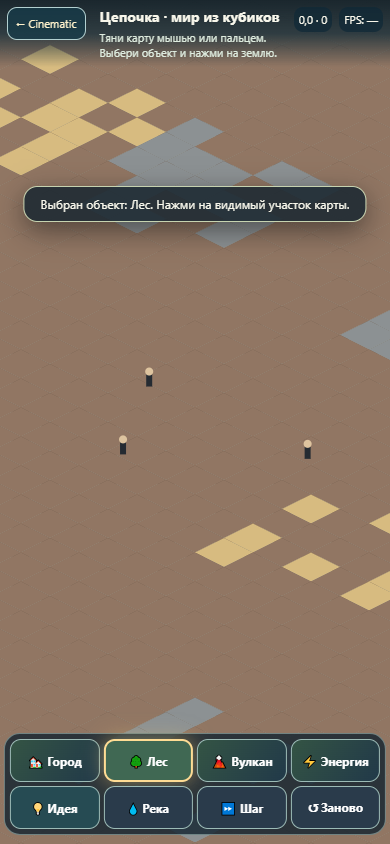
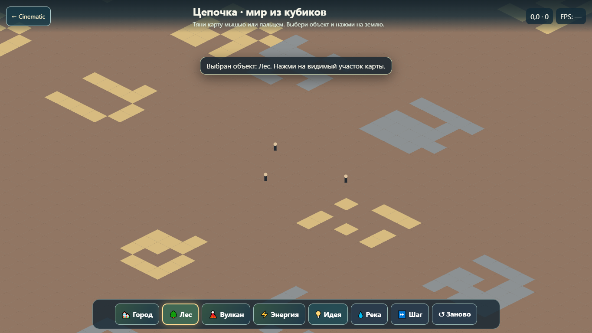
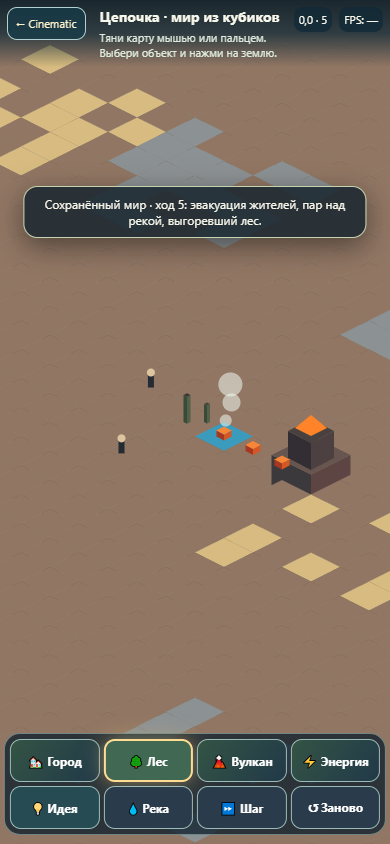
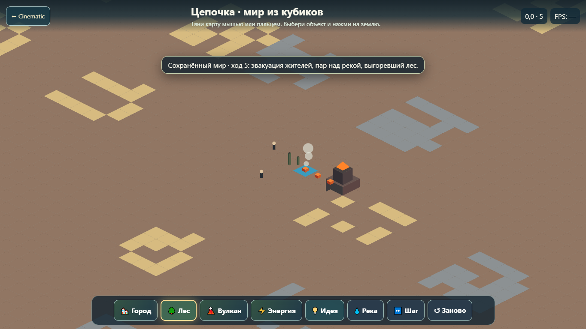

# Voxel Factory — воспроизводимое визуальное доказательство

Скриншоты созданы Playwright на Windows Chrome: desktop 1365×768 и эмуляция мобильного viewport 390×844. Они не являются тестом на физическом iPhone и не доказывают сертифицированные FPS.

| Сцена | Телефон (эмуляция) | Компьютер |
|---|---|---|
| Начало: сухая земля, три путника, без вулкана |  |  |
| Лес → река → вулкан → пар/пожар/эвакуация после перезагрузки |  |  |

Тест `node test/voxel-factory-ui.cjs` проверяет отсутствие начального вулкана, кликабельность построек и всех кнопок сценария, четыре основных эффекта, сохранность ID/координат после reload, текст события в интерфейсе, 20 перемещений мышью и настоящие CDP touch-события на мобильной эмуляции. Отдельный тест проверяет повреждённый localStorage и резервную копию без потери исходных данных.

`npm run test:cinematic` запускает 38 deterministic/architecture/graphics/AI тестов. `npm run test:cinematic:browser` последовательно запускает существующую QA и Voxel Factory. GitHub Actions выполняет оба набора и сохраняет новые скриншоты в артефакт `cinematic-mobile-proof`. Workflow проверки публикации сравнивает точные байты всех новых файлов с опубликованными GitHub Pages перед браузерным тестом.

**Блокеры публичного релиза:** серверная единая история с Telegram/Supabase, проверка FPS физического устройства и независимый финальный UI-релизный gate. Это QA материалов Draft PR, не ссылка на публичную игру.
